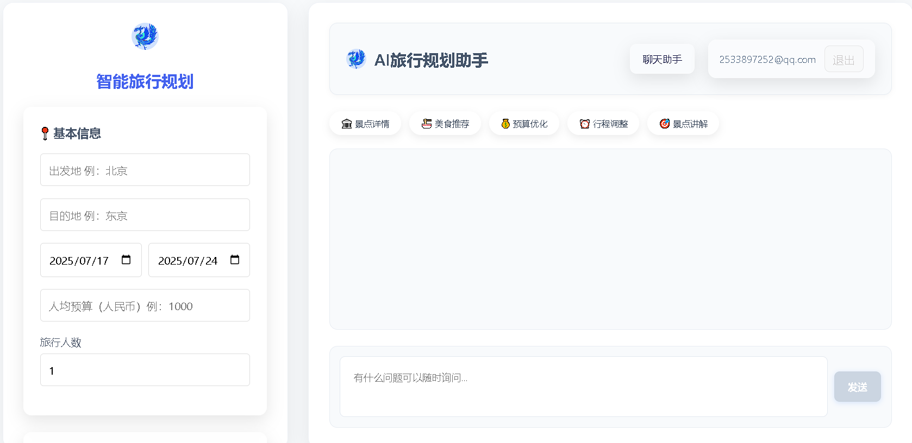

# 青鸾向导 (Qingluan Guide) - 下一代AI智能旅行助手 🚀

[](https://python.org)
[](https://flask.palletsprojects.com)
[](https://redis.io)
[](https://langchain.com)
[](https://chromadb.com)
[](LICENSE)

> **基于前沿多智能体架构的企业级AI旅行规划平台**  
> 融合RAG检索增强、实时记忆管理、智能PDF生成等核心技术，为用户提供个性化、智能化的旅行规划体验

## 📸 项目展示

<!-- 预留展示图片位置 -->


<div align="center">
  
  <p><i>主界面 - 智能对话与旅行规划</i></p>
</div>



<div align="center">
  <p><i>系统架构 - 多智能体协同工作流程</i></p>
</div>


## 🏗️ 技术架构

### 系统架构流程图
<div align="center">
  
  <p><i>数据流和组件交互关系</i></p>
</div>

### 多智能体系统架构
<div align="center">
  
  <p><i>智能体继承关系和协作模式</i></p>
</div>

## 💻 核心技术栈

### 🎯 前端技术
- **现代Web技术栈**: HTML5 + CSS3 + Vanilla JavaScript
- **响应式设计**: 适配桌面端、平板和移动设备
- **实时通信**: Server-Sent Events (SSE) 流式响应
- **交互体验**: Markdown渲染、代码高亮、表格展示
- **UI组件**: 自定义组件库，现代化界面设计

### 🛠️ 后端架构
- **Web框架**: Flask (轻量级、高性能)
- **WSGI服务器**: Gunicorn (生产级部署)
- **异步处理**: 支持并发请求和非阻塞I/O
- **API设计**: RESTful架构，清晰的接口规范
- **安全防护**: CSRF保护、XSS防护、SQL注入防护

### 🤖 AI引擎
- **语言模型**: OpenAI GPT-4/3.5-turbo、DeepSeek等多模型支持
- **框架集成**: LangChain (AI应用开发框架)
- **工作流引擎**: LangGraph (复杂智能体工作流)
- **模型上下文协议**: MCP (Model Context Protocol) 标准化工具集成
- **智能路由**: 基于意图识别的智能体选择算法

### 🧠 记忆与存储
- **分布式缓存**: Redis (高性能内存数据库)
- **关系数据库**: MySQL + SQLite 双数据库支持
- **向量数据库**: ChromaDB (语义搜索和相似度计算)
- **会话管理**: 基于Redis的分布式会话存储
- **数据持久化**: 多层存储架构，确保数据安全

### 🔍 搜索与检索
- **RAG技术**: 检索增强生成，提升回答准确性
- **向量化检索**: OpenAI embeddings + ChromaDB
- **混合搜索**: 结合关键词搜索和语义搜索
- **实时API集成**: Google Maps、搜索引擎、天气服务
- **智能缓存**: 多级缓存策略，优化响应速度

### 📊 数据处理
- **文档处理**: PDF、TXT等多格式文档解析
- **数据清洗**: 智能文本预处理和结构化
- **批量操作**: 高效的数据导入和处理流程
- **格式转换**: Markdown到PDF的智能转换
- **中文支持**: 完整的中文字体和编码支持

## 🌟 核心特性

### 🤖 多智能体系统
- **通用AI助手** (`NormalAgent`): 处理日常问答和通用任务

- **旅行规划师** (`PlannerAgent`): 专业的旅行方案制定

- **景点向导** (`AttractionGuide`): 详细的景点介绍和推荐

- **PDF生成器** (`PdfAgent`): 智能文档生成和格式化

### 📚 RAG增强搜索

- **知识库检索**：基于向量数据库的语义搜索，由大量PDF文件提取得到
- **精准问答**：结合检索结果和大型语言模型，提供基于上下文的准确回答
- **多源数据融合**：无缝整合结构化数据库和非结构化文本信息
- **可解释性**：回答时提供参考来源，增强可信度

### 🧠 Redis记忆系统
- **持久化记忆**: 基于Redis的对话上下文存储 (7天TTL)
- **多用户隔离**: 每用户独立的记忆空间
- **优雅降级**: Redis不可用时自动回退到内存模式
- **智能管理**: 最多保存60条历史消息，自动清理

### 💬 智能对话体验
- **流式响应**: 实时显示AI回复，提升用户体验
- **Markdown渲染**: 支持代码高亮、表格、列表等富文本
- **上下文连续性**: 记住对话历史，支持多轮深度交流
- **多种交互模式**: 文本对话、旅行规划、PDF生成

### 🗄️ 完整数据管理
- **SQLite数据库**: 高性能的本地数据存储
- **用户系统**: 安全的注册登录机制
- **历史记录**: 完整的对话历史保存和检索
- **数据安全**: 用户权限验证和数据隔离

## 🚀 快速开始

### 系统要求
- **Python**: 3.8 或更高版本
- **操作系统**: Windows / Linux / macOS
- **内存**: 建议 2GB 以上
- **存储**: 至少 500MB 可用空间

### 安装步骤

#### 1. 克隆项目

```bash
git clone <repository-url>
cd QL_guide
```

#### 2. 创建虚拟环境

```bash
python -m venv .venv

# Windows
.venv\Scripts\activate

# Linux/macOS
source .venv/bin/activate
```

#### 3. 安装依赖

##### 安装python库

```bash
pip install langchain-mcp-adapters langgraph "langchain[openai]"
pip install -r requirements.txt
```
---
##### 安装外部工具

一、安装 wkhtmltopdf

1. 下载地址

[👉 点击下载 wkhtmltopdf Windows 版（官方）](https://wkhtmltopdf.org/downloads.html)

> 建议下载 Windows 64-bit 版本（带 `msvc` 后缀），例如：  
> `wkhtmltox-0.12.6-1.msvc2015-win64.exe`

2. 安装步骤

1） 双击安装程序，安装到目录：`C:\Program Files\wkhtmltopdf`

2） 安装完成后，将以下路径加入系统环境变量（PATH）：

```
C:\Program Files\wkhtmltopdf\bin
```

 3） 验证是否安装成功
在 PowerShell 或 CMD 中运行：

```
wkhtmltopdf -V
```

输出类似版本信息即表示安装成功。

二、安装 Redis（Windows）

Redis 官方未提供 Windows 原生版本，但可通过以下方式安装：

使用 Redis for Windows 非官方构建（微软维护过）
1. 下载地址

   [https://github.com/microsoftarchive/redis/releases](https://github.com/microsoftarchive/redis/releases)

推荐版本：`Redis-x64-3.2.100.msi`

2. 安装步骤

   按照 Redis 安装器引导进行安装

3. 启动方式

安装完成后可以通过：

```bash
redis-server
```
来启动 Redis 服务。

三、安装 MySQL for Windows

1. 下载安装包

   [MySQL 官方下载页面](https://dev.mysql.com/downloads/installer/)，选择适合 Windows 系统的 MySQL Installer 进行下载。

2. 运行安装程序

   双击下载的安装包，按照安装向导的提示进行操作。在选择安装类型时，建议选择 "Developer Default"，这样会安装 MySQL Server、MySQL Workbench 等常用组件。

3. 配置 MySQL Server

   在安装过程中，会提示设置 root 用户的密码，务必牢记该密码。其他配置项可以使用默认设置。

4. 完成安装

   等待安装完成后，MySQL Server 会自动启动。

四、安装 MySQL Workbench

如果在安装 MySQL 时选择了 "Developer Default" 安装类型，MySQL Workbench 已经安装完成。如果需要单独安装，可以访问 [MySQL Workbench 官方下载页面](https://dev.mysql.com/downloads/workbench/)，选择适合 Windows 系统的安装包进行下载和安装。

##### 配置环境变量

创建 `.env` 文件：

```env
# 搜索API配置
SEARCHAPI_API_KEY=your_search_api_key_here

#DeepSeek
DEEPSEEK_API_KEY=your_deepseek_api_key_here
DEEPSEEK_API_URL=https://api.deepseek.com/v1

# OpenAI 代理
OPENAI_API_KEY=your_openai_api_key_here
OPENAI_API_URL=https://api.openai-proxy.org/v1
OPENAI_API_BASE=https://api.openai-proxy.org/v1

# redis 配置
REDIS_PASSWORD=your_redis_password_here
REDIS_URL=redis://localhost:6379

# Flask 配置
FLASK_SECRET_KEY=your_flask_secret_key_here

# 高德地图 API 密钥
GAODE_API_KEY=your_gaode_api_key_here

# RAG 增强搜索配置
DOC_DIR=./agent/RAG/pdf
VECTOR_DIR=./agent/RAG/knowledge1.demo
COLLECTION_NAME=travel_information
EMBED_MODEL=text-embedding-ada-002

# 数据库配置
DB_HOST=localhost
DB_USER=root
DB_PASSWORD=123456
DB_NAME=scenic_spots_db

# 部分系统常数
SIMILARITY_THRESHOLD=0.7  
NEARBY_DISTANCE=5.0  
```

#### 5. 初始化数据库 ⚠️ 重要步骤！

```bash
python database_self.py
```

#### 6. 启动Redis服务器（推荐）

```bash
python start_redis.py
```

#### 7. 导入 MySQL

```bash
# 登录 MySQL（需输入密码）
mysql -u root -p

# 创建数据库（若不存在）
CREATE DATABASE scenic_spots_db

# 导入sql文件
mysql -u root -p scenic_spots_db < your_load_position/QL_guide/agent/sql/mysql/scenic_spots_db_cities.db
mysql -u root -p scenic_spots_db < your_load_position/QL_guide/agent/sql/mysql/scenic_spots_db_provinces.sql
mysql -u root -p scenic_spots_db < your_load_position/QL_guide/agent/sql/mysql/scenic_spots_db_scenic_spots.sql
```

#### 8. 运行应用

```bash
python app.py
```

#### 9. 访问应用
打开浏览器访问: `http://localhost:5000`

## 📁 项目架构

```
QL_guide/
├── 📄 app.py                      # Flask主应用入口
├── 🗃️ app.db                      # SQLite数据库文件
├── 📋 requirements.txt            # Python依赖列表
├── 🚀 start_redis.py             # Redis启动脚本
├── 👁️ redis_viewer.py            # Redis数据查看工具
├── 🗄️ database_self.py           # 数据库初始化和操作
├── 🔧 db_manager.py              # 数据库管理GUI工具
│
├── 🤖 agent/                      # AI智能体核心模块
│   ├── ai_agent.py               # 多智能体管理器
│   ├── redis_memory.py           # Redis记忆存储
│   ├── pdf_generator.py          # PDF生成智能体
│   ├── attraction_guide.py       # 景点向导智能体
│   ├── prompts.py               # 智能体提示词模板
│   ├── mcp_server.py            # MCP协议服务器
│   ├── RAG/                      # RAG相关模块
│   ├── sql/                      # SQL相关模块
│
├── 🎨 templates/                  # HTML模板文件
│   ├── index.html               # 首页
│   ├── login.html               # 登录注册页面
│   ├── chat.html                # 聊天界面
│   └── travel.html              # 旅行规划界面
│
├── 🎭 static/                     # 静态资源文件
│   ├── style.css                # 主样式文件
│   ├── chat.css                 # 聊天界面样式
│   ├── travel.css               # 旅行界面样式
│   ├── script.js                # 主要JavaScript功能
│   ├── travel.js                # 旅行规划交互逻辑
│   └── *.jpg/png                # 图片资源
│
└── 📦 redis/                      # Redis服务器文件
    ├── dump.rdb                 # Redis数据快照
    ├── redis-server.exe         # Windows Redis服务器
    ├── redis-cli.exe            # Redis命令行工具
    └── *.conf                   # Redis配置文件
```

## 🎯 功能模块详解

### 🤖 多智能体系统

#### 1. 通用AI助手 (NormalAgent)
- **功能**: 处理日常问答、编程问题、知识查询
- **特点**: 上下文理解、代码生成、逻辑推理
- **使用场景**: 学习辅导、问题解答、创意写作

#### 2. 旅行规划师 (PlannerAgent)
- **功能**: 制定详细旅行方案
- **整合服务**: 航班查询、酒店预订、景点推荐
- **输出格式**: 结构化行程表、预算分析
- **使用场景**: 假期规划、商务出行、深度游

#### 3. 景点向导 (AttractionGuide)
- **功能**: 提供详细景点信息和推荐
- **数据来源**: 实时搜索API
- **特色**: 本地化推荐、实用攻略
- **使用场景**: 目的地探索、行程优化

#### 4. PDF生成器 (PdfAgent)
- **功能**: 智能文档生成和格式化
- **支持格式**: Markdown转PDF、富文本排版
- **特色**: 自动排版、样式美化
- **使用场景**: 报告生成、文档制作

### 🧠 记忆系统架构

#### 双层存储设计
```
📊 SQLite数据库 (长期存储)
├── 用户信息管理
├── 完整对话历史
└── 数据统计分析

🔄 Redis缓存 (工作记忆)
├── 活跃对话上下文 (60条)
├── 智能体状态管理
└── 7天自动过期
```

#### 记忆管理特性
- **上下文窗口**: 每个会话最多60条消息
- **自动清理**: 超出限制时智能清理最旧消息
- **用户隔离**: 完全独立的用户记忆空间
- **降级策略**: Redis不可用时无缝切换到内存模式

### 🌐 Web界面功能

#### 用户管理系统
- **注册登录**: 基于邮箱的安全认证
- **支持邮箱**: QQ、Gmail、Outlook、163、Foxmail
- **会话管理**: 安全的session机制
- **权限控制**: 用户数据完全隔离

#### 交互界面
- **响应式设计**: 适配手机、平板、电脑
- **实时对话**: 流式响应显示
- **历史管理**: 对话恢复、删除、清空
- **多模式切换**: 聊天/旅行规划一键切换

## 🔧 高级配置

### Redis配置优化
```python
# 自定义Redis配置
redis_config = {
    'redis_host': 'localhost',
    'redis_port': 6379,
    'redis_db': 0,
    'redis_password': None,
    'max_memory_length': 60,        # 记忆条数
    'memory_ttl': 7*24*3600,        # 7天过期
    'key_prefix': 'agent_memory:'
}
```

### 智能体参数调优
```python
# 在prompts.py中调整
AGENT_CONFIGS = {
    'temperature': 0.7,             # 创意度控制
    'max_tokens': 2000,             # 回复长度限制
    'context_window': 60,           # 上下文窗口
    'stream_chunk_size': 1024       # 流式响应块大小
}
```

## 🛠️ 开发和运维工具

### 数据库管理工具
```bash
# 启动GUI管理界面
python db_manager.py
```
功能包括：
- 📊 数据库统计和分析
- 👥 用户数据管理
- 💬 对话记录查看
- 🗑️ 数据清理工具

### Redis监控工具
```bash
# 查看Redis数据
python redis_viewer.py

# 记忆系统状态监控
curl http://localhost:5000/memory_stats
```

### 命令行工具
```bash
# 查看用户统计
python -c "from database_self import db; print(db.get_user_stats('user@example.com'))"

# 清理用户数据
python -c "from database_self import db; db.clear_user_history('user@example.com')"

# 删除特定对话
python -c "from database_self import db; db.delete_conversation('conversation_id')"
```

## 📊 性能优化策略

### 数据库优化
- **索引优化**: 针对查询模式建立合适索引
- **连接池**: 数据库连接复用机制
- **查询优化**: 参数化查询防止SQL注入
- **分页加载**: 大量历史记录分页显示

### Redis优化
- **内存管理**: 自动清理过期数据
- **连接复用**: 单例模式Redis连接
- **序列化优化**: JSON格式消息存储
- **网络优化**: 本地Redis部署减少延迟

### Web性能优化
- **流式响应**: 减少用户等待时间
- **静态资源**: CSS/JS文件压缩
- **异步处理**: 非阻塞I/O操作
- **缓存策略**: 浏览器和服务器端缓存

## 🔒 安全特性

### 用户认证安全
- **密码保护**: 安全的密码存储机制
- **会话管理**: 基于Flask Session的安全认证
- **权限验证**: 每个请求的用户权限检查
- **数据隔离**: 用户间数据完全隔离

### 数据安全
- **SQL注入防护**: 参数化查询
- **XSS防护**: 输入验证和输出转义
- **CSRF防护**: 表单令牌验证
- **敏感信息**: 环境变量存储API密钥

## 🚀 部署指南

### 开发环境部署
```bash
# 开发模式运行
python app.py
# 应用将在 http://localhost:5000 启动
```

## 🔧 故障排除

### 常见问题解决

#### 1. Redis连接失败
```
❌ 错误: Redis连接失败
✅ 解决: python start_redis.py
```

#### 2. 数据库未初始化
```
❌ 错误: no such table: users
✅ 解决: python database_self.py
```

#### 3. 依赖包缺失
```
❌ 错误: ModuleNotFoundError
✅ 解决: pip install -r requirements.txt
```

#### 4. API密钥未配置
```
❌ 错误: Invalid API Key
✅ 解决: 检查.env文件中的OPENAI_API_KEY
```

### 调试技巧
- 检查应用启动日志
- 使用 `redis_viewer.py` 查看Redis数据
- 使用 `db_manager.py` 检查数据库状态
- 访问 `/memory_stats` 查看系统状态

## 🤝 贡献指南

欢迎贡献代码！请遵循以下步骤：

1. Fork 项目仓库
2. 创建功能分支 (`git checkout -b feature/新功能`)
3. 提交更改 (`git commit -am '添加新功能'`)
4. 推送到分支 (`git push origin feature/新功能`)
5. 创建 Pull Request

### 代码规范
- 遵循 PEP8 Python代码规范
- 添加适当的注释和文档字符串
- 编写单元测试覆盖新功能
- 确保现有测试通过

## 📄 许可证

本项目采用 [MIT许可证](LICENSE) - 查看LICENSE文件了解详情

## 🙏 致谢

感谢以下开源项目的支持：

- [Flask](https://flask.palletsprojects.com/) - 轻量级Web框架
- [Redis](https://redis.io/) - 高性能内存数据库
- [OpenAI](https://openai.com/) - 先进的AI模型服务
- [SQLite](https://www.sqlite.org/) - 嵌入式数据库引擎
- [LangChain](https://langchain.com/) - AI应用开发框架


**青鸾向导** - 让AI助手更智能，让对话更自然！ 🚀✨
